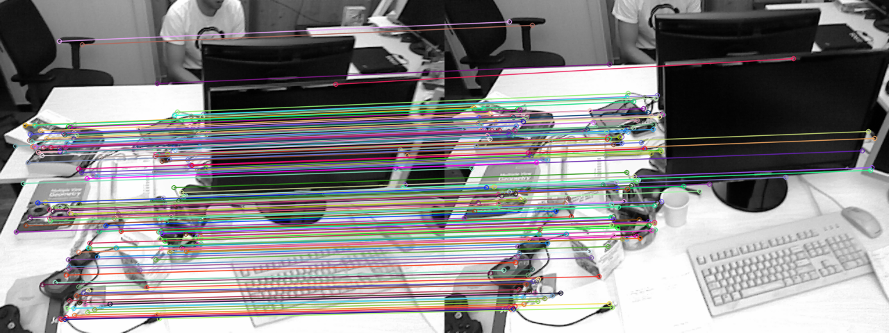

# Project: ORB Acceleration

## Introduction
In this project, you will accelerate the ORB feature extraction by HLS and run on the ZCU104 board.

For the details of the ORB algorithm, you can refer to 
* E. Rublee, V. Rabaud, K. Konolige, and G. Bradski, “Orb: An efficient alternative to sift or surf,” in 2011 International Conference on Computer Vision, 2011, pp. 2564–2571. 
* M. Calonder, V. Lepetit, C. Strecha, and P. Fua, “Brief: Binary robust independent elementary features,” in Proc. 11th European Conference on Computer Vision, 2010, pp. 778–792.


## Build Baseline
In this project, a baseline of the entire ORB implementation is given to you, follow the below steps to rebuild it. The toolchain version used is 2020.2.

1. Open CMD (not powershell), and run bellow command.
    ```
    C:\Xilinx\Vitis\2020.2\settings64.bat
    ```
    change the installation path if needed.

1. Change the directory to `Project` folder using `cd`.
1. Run C Simulation
    ```
    build.bat csim
    ```
    A Vitis_HLS project is created in folder `hls_project`. A small input file in `test` folder is provided for fast simulation, the reference output is:
    ```
    ############################################
    #             Begin Testbench              #
    ############################################
    
    input shape: (60, 80)
    N features: 6
    36 18 0 8EBD4C90 7B9A1619 F7024B36 91B33BE9 8866BE2C 1398179E 67B8F1DF 9A26AD22
    39 19 0 8CBA4CFD EB9C0638 970E6B36 9583AB6B 847CE820 DB191196 6780A1DF 9A42A732
    56 22 0 42CE0CF3 7F15D1DB 955A6B5A 10C79B89 986E9F0F 19BD3587 EF50CD9D FA58B138
    33 24 0 CCF88CFF F99E0E3A F7062BBE 9D17AA6B E4B6E821 FFDC55D7 EFC891DE 9A628F33
    55 27 0 6A7C0953 1B92F9D3 ED722B0A C1CFF3C8 5027DF2E 0BF48C89 4252D44D FC7A183A
    51 35 0 E0768C67 14DAD997 D27163A9 E95F8178 F91C1E9B 1AB45079 58E94E45 F06901B3
    
    ############################################
    #              End Testbench               #
    ############################################
    ```
    The output is the X, Y coordinates and the 256-bit descriptor. **It doesn't matter if your descriptor value is slightly different from the reference,** since the precision is measured by the Hamming Distance.

1. Run C Synthesis
    ```
    build.bat csynth
    ```

1. Run Co Simulation
    ```
    build.bat cosim
    ```
1. Generate block design
    ```
    build.bat bd
    ```
    A Vivado project will be created in folder `vivado_project`

1. Generate bitstream
    ```
    build.bat bit
    ```
    The `.bit` and `.hwh` file can be found in the `Project` folder

1. You can use a single command to generate bitstream. 
    ```
    build.bat all
    ```
    It is recommanded to clean the workspace before each run
    ```
    build.bat clean
    ```

## Run on the board
1. The Python scripts with test images is provided in the `board` folder.
1. Run on board
    ```
    python3 ORB.py baseline.bit
    ```
    replace the `baseline.bit` with your own bitstream. You should see something like:
    ```
    *** Program FPGA with baseline.bit ***
    *** Program FPGA done ***
    input shape: 480 640
    resized shape: 480 640
    *** Run Single test ***
    FAST threshold: 60
    Keypoints in img1: 443
    Keypoints in img2: 556
    *** Match and draw keypoints ***
    *** Run Multiple test ***
    FAST threshold: 40
    Average latency: 137.73664236 ms
    ```
    The output image (`matches.png`) is the feature matching result of two images, useit to check the quality of your output.
    <p align="center">
        
    </p>

## Requirements
1. Make sure your design can be **successfully** run on the board.
1. You can make **any changes** on the baseline to **minimize** the latency.
	> Hint: You can use all the APIs in the Vitis Vision Library
1. You should write a report which may includes
    * Result screenshots in each step
    * The optimization strategies
    * The perfromance and resource utilization
    * Any problems you encountered
    * Any interesting ideas

## Grading
The final score is composed by three parts:
* **Base (60%):** Successfully run on the board with a latency **at least 50 ms**. 
* **Ranking:** This score is determined by your ranking position of the latency.
    * **30%:** Rank 1 to 10
    * **20%:** Rank 11 to 20
    * **10%:** Rank 21 to 30
    * **5% :** Rank 31 and below
* **Report (10%):** Report writing

## Submission: Deadline on 2024-1-21 23:59
You should submit:
* The source code and instructions on how to run it.
* Bitstream, HWH, and the host code (python script or executable files).
* Report in **PDF** format.

Please compress all the files in **ZIP** format.

## Overdue Policy
* Submit on time, get all scores.
* Submit within 24 hours of the deadline, get half of the score.
* Submit more than 24 hours after the deadline, get 0 score.
